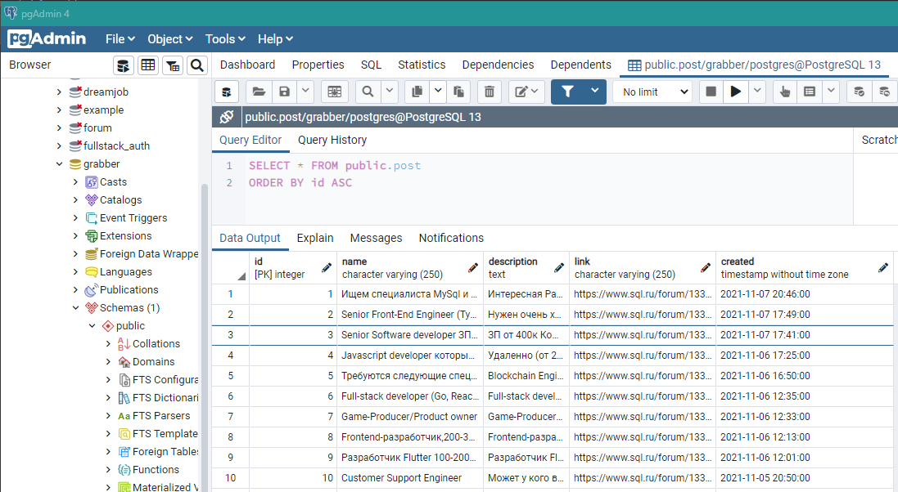
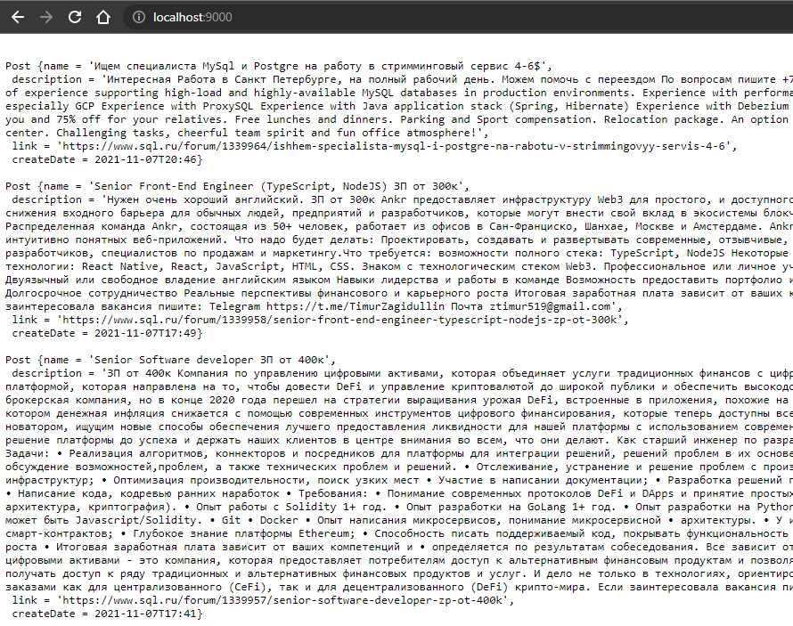

# Проект - Grabber
[](https://travis-ci.com/saimon494/job4j_grabber)
[](https://codecov.io/gh/saimon494/job4j_grabber)

## О проекте

Проект представляет собой парсер вакансий со [страницы](https://www.sql.ru/forum/job-offers) sql.ru. 
Можно добавить новый сайт без изменения кода.

Все распарсенные вакансии преобразуются в модели данных в БД PostgreSQL.

Система запускается по расписанию с помощью планировщика заданий Quartz, 
период запуска указывается в файле `app.properties`.

Доступ к интерфейсу сайта осуществляется с помощью библиотеки Jsoup (парсинг HTML).

В отдельном потоке запускается сервер, реализованный на ServerSocket, 
обратившись к которому можно получить список всех распарсенных вакансий.

## Сборка

Для сборки проекта необходимо:
1. Установить JDK 14.
2. Установить PostgreSQL, задать логин - postgres, пароль - password.
3. Скачать из [папки](https://github.com/saimon494/job4j_grabber/tree/main/target) файл `grabber.jar`
4. Создать в pg_Admin БД grabber.
5. Открыть Query Tool и из папки db запустить `update_002.sql`.

## Использование
Запускаем парсинг из `cmd`:
```
java -jar grabber.jar
```
В БД появились распарсенные вакансии:  



По [ссылке](http://localhost:9000/) доступен список всех вакансий:  



## Контакты
[](https://t.me/Saimon494)